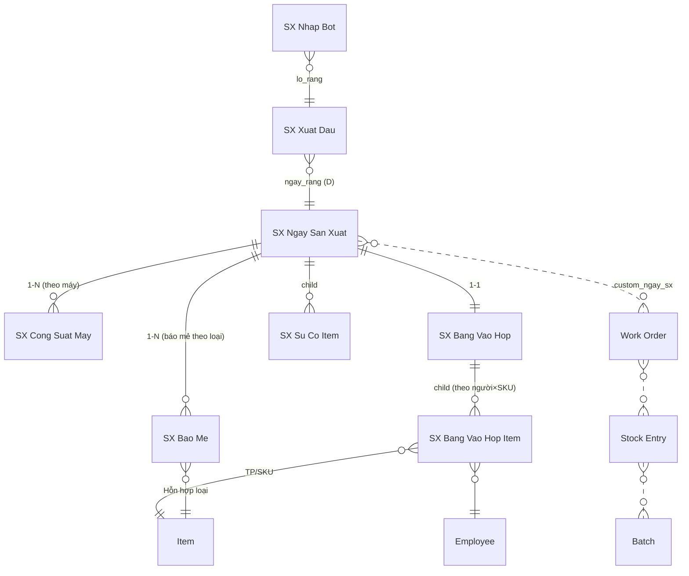

# CODER PACK v2 — App `sx` (Portal Sản Xuất RVHG, route `/sx`)

> **Handoff cho Claude Code.** Đây là bản v2 — thay thế hoàn toàn v1. Build theo phương pháp
> nextcode + skills: `frappe-app-build-profile` (kiểu NPP) → `nextcode-build` →
> `frappe-portal-spa` → `frappe-app-shipping-gotchas`. Site: `a.rongvanghoanggia.com`
> (Frappe/ERPNext v16). **Đọc hết file này trước khi gõ lệnh đầu tiên.**
>
> Triết lý xuyên suốt: **công nhân lowtech, thao tác tối thiểu tuyệt đối.** Chỉ 4 điểm nhập
> liệu trong toàn nhà máy. Truy xuất ở mức **ngày × loại** (đã được chủ đầu tư quyết định có
> ý thức — KHÔNG nâng cấp lên mức thùng/mẻ cá thể trừ khi có chỉ đạo mới).

---

## 0. Build brief

```
# Build brief — sx (v2)
Nền tảng: Frappe/ERPNext v16 custom app, theo phương pháp nextcode.

1. Domain:      Số hoá + truy xuất nguồn gốc sản xuất bánh & bột đậu xanh RVHG.
                1 dây chuyền, 1 ca. Pipeline LỆCH NGÀY (xuất đậu D-1, rang D, nghiền D+1,
                trộn+ủ, đóng gói D+n). Công nhân lowtech → 4 điểm nhập, phần lớn khâu 0 chạm.
                Truy xuất mức NGÀY × LOẠI (không theo thùng/mẻ cá thể).
3. Vai trò:     4 role: SX Thu Kho / SX To Tron / SX To Dong Goi / SX Quan Ly.
                Method-mediated, guard role dòng đầu mọi whitelisted method.
4. Giao diện:   Portal SPA `/sx` (www page), vanilla JS no-build, hash router,
                import map cache-bust, CSS prefix `sx-`, tablet-first, nút to, numpad.
5. Analytics:   Dashboard quản lý: sản lượng theo SKU, năng suất/người (vào hộp),
                công suất/máy (cán), truy xuất lô 2 chiều.
6. Ràng buộc:   Backend = Python whitelisted method trong app (KHÔNG Server/Client Script);
                fieldname ASCII; fixtures export; py_compile + node --check + validator
                0 ERROR; commit-per-feature (P0..P7); đọc source Frappe thật khi nghi ngờ.
7. Git:         push nhánh dev (+ default nếu được phép).
```

---

## 1. Quyết định kiến trúc (ĐÃ CHỐT với chủ đầu tư qua nhiều vòng — KHÔNG tự ý đổi)

| # | Quyết định | Hệ quả |
|---|---|---|
| D1 | **BOM 3 tầng.** T1: Đậu → [luộc→rang→sàng→ủ→vỡ→nghiền] → **BTP Bột** (tồn qua ngày, batch = lô rang). T2: Bột + phụ liệu → [trộn→ủ 24h] → **BTP Hỗn hợp** (9 loại, mỗi loại 1 công thức). T3: Hỗn hợp → [cán→tạo viên→gói→vào hộp] → **TP** (40–50 SKU, chủ yếu khác bao bì). | 3 nhóm Item, 3 lớp Work Order khi chốt ngày |
| D2 | **Không Job Card / Routing / operations trong BOM.** | Không costing theo giờ máy (nhân công tính công nhật + lương sản phẩm khâu vào hộp) |
| D3 | **Truy xuất mức NGÀY × LOẠI.** KHÔNG có thùng ủ / mẻ trộn cá thể "sống" trong hệ thống. Tổ trộn báo tổng số mẻ mỗi loại cuối ngày. | Thu hồi theo lô-ngày (phạm vi xác định, hợp lệ ISO). Mất truy-theo-thùng. |
| D4 | **Xuất kho tầng 2 theo ĐỊNH MỨC BOM × số mẻ** (không theo cân thực từng mẻ). Hao hụt lòi ra ở **kiểm kê định kỳ** (Stock Reconciliation, làm tay trên Desk). | Không đo hao hụt realtime mức mẻ |
| D5 | **Backflush NVL theo BOM** (Manufacturing Settings). | Không ai nhập phiếu xuất kho tay cho từng mẻ |
| D6 | **FIFO tự động cho bột BTP.** Khi trừ bột lúc chốt ngày, hệ thống tự pick lô rang R cũ nhất trước. Đây là **mắt xích cuối** nối Hỗn hợp → lô rang → lô đậu. | Không thao tác thêm; giữ truy xuất tới tận đậu nguyên liệu |
| D7 | **Đo lường tối thiểu:** Bột T1 = số bao đậu × yield (suy từ BOM T1, KHÔNG cấu hình riêng). TP = tổng bảng vào hộp. Công suất máy cán = tổng số thùng ủ (dữ liệu OEE thuần, đứng riêng). | Bột thùng inox không cân chuẩn → suy theo định mức |
| D8 | **Rang & Sơ chế: 0 thao tác trong `sx`.** Ghi nhiệt độ rang là việc **thẩm tra của QC** → thuộc app `iso` (làm sau). Self-check "loại 1kg đầu" cũng thuộc QC. | 2 khâu biến mất khỏi app công nhân |
| D9 | **Bánh giữ 0 CCP** theo HACCP hiện hành (đã xác nhận từ file HACCP thật: bảng cây quyết định trống cột CCP, lịch sử "bỏ CCP" 1/11/2020). `sx` **KHÔNG gán nhãn CCP** ở bất kỳ đâu. Bột có 1 CCP (mối hàn túi) nhưng thẩm tra thuộc QC → app `iso`. | App `sx` thuần vận hành + truy xuất, không phải app an toàn thực phẩm |
| D10 | **App `iso` TÁCH RIÊNG, làm sau.** `iso` sẽ link tới lô/ngày trong `sx` làm đối tượng thẩm tra (một chiều ISO→SX). `sx` chạy được kể cả khi `iso` chưa tồn tại. | KHÔNG build gì thuộc QC/thẩm tra/SSOP trong pack này |
| D11 | **Mọi Work Order + Stock Entry sinh lúc CHỐT NGÀY** với số thực tế, `skip_transfer=1` (Manufacture rút NVL thẳng từ kho nguồn, không bước Material Transfer, không WIP lơ lửng). | Cả chu trình 1 ngày chỉ đẻ vài chứng từ kho |
| D12 | **1 ca** → không field ca ở bất kỳ đâu. | |
| D13 | **Mã lô hiển thị TO trên màn hình để ghi tay ra thẻ.** KHÔNG bắt buộc máy in. Batch vẫn "sống" trong hệ thống dù thẻ vật lý ghi tay. | Zero đầu tư phần cứng; QR/tem in = Phase 2 |
| D14 | **Nhập bột lô R vào Kho BTP do TỔ TRỘN làm** (không phải thủ kho — bột chuyển từ khu nghiền sang khu trộn, tổ trộn là người nhận). | Thủ kho gọn còn 1 neo chính |

### Chuỗi truy xuất ISO 22000 (điều khoản 8.3) — mức ngày × loại

```
TP (batch NSX ngày, theo SKU)
  └─ Stock Entry T3  ──► BTP Hỗn hợp loại A, ngày X   (batch HH-A-YYYYMMDD)
       └─ Stock Entry T2 (trừ bột FIFO) ──► BTP Bột, lô rang R cũ nhất  (batch = R-DDMMYY)
            └─ Stock Entry T1 ──► Đậu xanh, lô nhập NCC  (batch đậu)
                 └─ Phiếu xuất đậu D-1 (thủ kho) ──► lô đậu nhà cung cấp
```
Truy xuất 2 chiều NVL↔TP dùng **Serial & Batch Traceability Report chuẩn v16** (không tự build report).
Đường/dầu: nối qua "lô đang mở" (batch lô NCC đang dùng tại thời điểm sản xuất).

---

## 2. Bốn điểm nhập liệu (bản đồ thao tác — nền tảng của toàn bộ thiết kế)

| Ai | Khi nào | Thao tác | DocType ghi |
|---|---|---|---|
| **Thủ kho** | Chiều D-1 | Xuất đậu cho ngày mai → sinh **lô rang R** (chọn lô đậu NCC + số bao + 1 tap). Thi thoảng: mở lô đường/dầu mới. | `SX Xuat Dau`, `SX Lo Vat Tu` |
| **Tổ trộn** | Trong ngày + cuối ngày | (a) Nhập bột lô R vào Kho BTP khi nhận từ khâu nghiền (chọn lô R + 1 tap). (b) Cuối ngày báo tổng số mẻ mỗi loại. | `SX Nhap Bot`, `SX Bao Me` |
| **Tổ đóng gói** | Cuối ca | (a) Người chạy máy cán: bấm tổng số thùng ủ máy chạy (OEE). (b) Tổ vào hộp: số hộp từng SKU cho từng công nhân + phương thức. | `SX Cong Suat May`, `SX Bang Vao Hop` |
| **Tổ trưởng ca** *(thường kiêm 1 trong 3 vai trên)* | Cuối ngày | 1 tap **Chốt ngày** → backend sinh toàn bộ WO/SE/Batch/lương. | submit `SX Ngay San Xuat` |

**0 chạm:** khâu rang, khâu sơ chế/nghiền (người vận hành), mọi công nhân đứng máy (trừ người cán bấm 1 số cuối ca). Không ai gõ chữ. Không ai chọn lô NVL thủ công (FIFO tự gắn). Không ai làm phiếu xuất kho tay.

---

## 3. DocType Blueprint

**App:** `sx` · **Module:** `SX` · Mọi fieldname ASCII không dấu. Label tiếng Việt có dấu.

### ERD



> **Ghi chú quan hệ:** `SX Xuat Dau` và `SX Nhap Bot` **KHÔNG** phải con của `SX Ngay San Xuat`
> vì chúng lệch ngày. Chúng là **document độc lập** liên kết mềm. Chỉ `SX Bao Me`,
> `SX Cong Suat May`, `SX Bang Vao Hop`, `SX Su Co Item` gắn vào phiếu ngày.

### 3.1 `SX Xuat Dau` — phiếu xuất đậu → sinh lô rang (neo gốc truy xuất)

- Naming series: `SXXD-.YYYY.-.#####` · **Is Submittable: Yes** · Title: `lo_rang`
- Fields: ngay_xuat (Date, reqd, default today) · ngay_rang (Date, reqd, default today+1) ·
  lo_rang (Data, read_only, sinh code `R-DDMMYY(ngay_rang)`, unique) · lo_dau_ncc (Link Batch,
  reqd, filter item đậu, gợi ý FIFO) · so_bao (Int, reqd, >0) · kl_bao_kg (Float, default
  SX Settings.kl_bao_dau_kg) · dau_kg (Float, read_only = so_bao × kl_bao_kg) · se_xuat
  (Link Stock Entry, read_only — phase 1 để trống, chỉ neo truy vết) · ghi_chu (Small Text).

### 3.2 `SX Lo Vat Tu` — "lô đang mở" đường/dầu

- `SXLV-.YYYY.-.#####` · Submittable: No · Title: `vat_tu`
- Fields: vat_tu (Select `Đường\nDầu`, reqd) · item (Link Item, reqd) · lo_ncc (Link Batch) ·
  ngay_mo (Date, reqd, default today) · dang_mo (Check — 1 = hiện hành; mở lô mới set lô cũ =0).

### 3.3 `SX Nhap Bot` — nhập bột lô R vào Kho BTP (tổ trộn)

- `SXNB-.YYYY.-.#####` · **Is Submittable: Yes** · Title: `lo_rang`
- Fields: ngay_nhap (Date, reqd, default today) · xuat_dau (Link SX Xuat Dau, reqd — lô đã rang,
  chưa nhập) · lo_rang (Data, fetch, read_only) · bot_kg (Float, read_only = dau_kg × yield BOM T1)
  · batch_bot (Link Batch, read_only, set khi submit) · se_nhap (Link Stock Entry, read_only).
- **GATE-C đã chốt: A.** on_submit: Batch `batch_id=lo_rang` (+custom_lo_rang) → SE **Material
  Receipt** bot_kg vào Kho BTP. Đậu không trừ realtime (kiểm kê định kỳ).

### 3.4 `SX Ngay San Xuat` — phiếu ngày

- `SXN-.YYYY.-.MM.-.DD.-.##` · **Is Submittable: Yes** · Title: `ngay` · Track Changes
- Fields: ngay (Date, reqd, unique docstatus<2) · trang_thai (Select `Đang chạy\nĐã chốt\nĐã huỷ`,
  read_only) · bao_me (Table SX Bao Me) · cong_suat_may (Table SX Cong Suat May) · su_co (Table
  SX Su Co Item) · tong_hop_tp (Int, read_only) · tong_luong_sp (Currency, read_only) ·
  ds_wo_se (Small Text — log JSON chứng từ) · ghi_chu (Small Text).
- **Child `SX Bao Me`:** hon_hop (Link Item BTP-HH, reqd) · so_me (Int, reqd, >0) · co_me_kg
  (Float, read_only từ BOM.custom_co_me_chuan_kg) · tong_kg (Float, read_only) · batch_hh
  (Link Batch, read_only, set khi chốt).
- **Child `SX Cong Suat May`:** may (Link SX May, reqd) · so_thung (Int, reqd, >0) · nguoi_chay
  (Link Employee) · ghi_chu (Data).
- **Child `SX Su Co Item`:** thoi_diem (Datetime, default now) · loai (Select `Hỏng máy\nThiếu
  NVL\nMất điện\nChất lượng\nKhác`, reqd) · mo_ta (Small Text) · phut_dung (Int).
- Submit CHỈ qua `chot_ngay`. on_cancel: huỷ ngược ds_wo_se + xoá SalaryProduct.

### 3.5 `SX Bang Vao Hop` (+ child `SX Bang Vao Hop Item`) — như v1

ngay_sx (unique docstatus<2) · dong (Table, reqd) · tong_hop/tong_tien read_only.
Child: nhan_vien · san_pham (TP) · phuong_thuc (`Thủ công\nMáy hỗ trợ`) · so_hop >0 ·
don_gia/thanh_tien (lookup server-side).

### 3.6 `SX Don Gia Vao Hop` — như v1

phuong_thuc (reqd) · san_pham (trống = mọi SP) · don_gia (reqd) · hieu_luc_tu (reqd).
Lookup: (san_pham, phuong_thuc) → fallback (trống, phuong_thuc) → hieu_luc_tu max ≤ ngày SX.

### 3.7 `SX May` — danh mục máy cán

`field:ma_may` · ma_may (Data, reqd) · ten_may (Data) · cong_suat_dinh_muc (Int, thùng/ngày) ·
dang_dung (Check).

### 3.8 `SX Settings` — Single

cong_ty · item_bot · kho_nvl/kho_btp/kho_tp · kl_bao_dau_kg. Yield suy từ BOM T1 (D7).
KHÔNG ngưỡng CCP (app iso, D9).

### 3.9 Custom Fields (fixtures, fieldname ASCII)

| DocType | Fieldname | Type | Options/Notes |
|---|---|---|---|
| Item | custom_sx_nhom | Select | `\nNVL\nBTP-Bot\nBTP-HH\nTP\nBao Bi` |
| Item | custom_batch_prefix | Data | vd `BNC`, `HH-A`, `BDX01` |
| BOM | custom_co_me_chuan_kg | Float | cỡ mẻ chuẩn (BOM hỗn hợp) |
| BOM Item | custom_nl_tron | Check | dòng NVL nhóm trộn |
| Work Order | custom_ngay_sx | Link SX Ngay San Xuat | |
| Stock Entry | custom_ngay_sx | Link SX Ngay San Xuat | |
| Batch | custom_lo_rang | Data | batch bột: = mã lô R |

**Mã lô (code sinh):** lô rang `R-DDMMYY` (trùng → -2); hỗn hợp `{prefix}-YYYYMMDD`;
TP `{prefix}-DDMMYY`.

---

## 4. Permission Matrix

Roles: `SX Thu Kho`, `SX To Tron`, `SX To Dong Goi`, `SX Quan Ly`.

| DocType | Thu Kho | To Tron | To Dong Goi | Quan Ly |
|---|---|---|---|---|
| SX Xuat Dau | RWCS | | | RWCS + Cancel/Amend |
| SX Lo Vat Tu | RWC | | | RWC + Delete |
| SX Nhap Bot | | RWCS | | RWCS + Cancel/Amend |
| SX Ngay San Xuat | | RWC | RWCS | full |
| SX Bang Vao Hop | | | RWCS | full |
| SX Don Gia Vao Hop | | | R | RWC + Delete |
| SX May | R | R | R | RWC |
| SX Settings | | | | RW |

- System Manager: full. KHÔNG DocPerm cho 3 tổ trên Employee/WO/SE/Batch/SalaryProduct —
  method-mediated, chỉ trả field whitelist (Employee: name, employee_name).
- User tablet: `thukho@rvhg`, `totron@rvhg`, `donggoi@rvhg`.

---

## 5. Integration & Backend Plan

### 5.1 Touch points: BOM 3 tầng không operations (T1 yield; T2 custom_nl_tron +
custom_co_me_chuan_kg; T3 gam hỗn hợp/hộp + bao bì). WO skip_transfer=1, use_multi_level_bom=0.
SE Manufacture qua make_stock_entry + FIFO bundle v16. Manufacturing Settings: Backflush=BOM,
Overproduction 5%. SalaryProduct: GATE-B.

### 5.2 hooks.py: doc_events on_cancel; fixtures Role(4)/Custom Field/Print Format.
Không scheduler, không override, không Server/Client Script.

### 5.3 Whitelisted API

| Method | Ai gọi | Làm gì |
|---|---|---|
| portal.get_boot | mọi role | context đầy đủ theo role |
| portal.xuat_dau(lo_dau, so_bao, kl_bao, ngay_rang) | Thu Kho | tạo+submit, trả lo_rang |
| portal.mo_lo_vat_tu(vat_tu, item, lo_ncc) | Thu Kho | đổi lô đang mở |
| portal.list_lo_cho_nhap_bot() | To Tron | lô R đã rang, chưa nhập |
| portal.nhap_bot(xuat_dau) | To Tron | tạo+submit, trả lo_rang/bot_kg/batch |
| portal.bao_me(ngay_sx, rows) | To Tron | upsert child bao_me |
| portal.cong_suat_may(ngay_sx, rows) | To Dong Goi | upsert child cong_suat_may |
| portal.luu_bang_vao_hop(ngay_sx, rows) | To Dong Goi | upsert draft, đơn giá server |
| portal.ghi_su_co(...) | To Dong Goi, To Tron | append sự cố |
| portal.get_or_create_ngay(ngay) | To Tron, To Dong Goi | phiếu ngày draft |
| chot.chot_ngay(ngay_sx) | To Dong Goi, Quan Ly | orchestrator §5.4 |
| portal.dashboard(tu_ngay, den_ngay) | Quan Ly | số liệu V5 |
| portal.truy_xuat(batch_tp) | Quan Ly | chuỗi ngược TP→HH→R→đậu |

### 5.4 chot_ngay

1. Validate: docstatus=0; bảng vào hộp tổng>0; đơn giá đủ; tồn đủ (kể cả HH sinh ở bước 2).
2. T2 mỗi dòng bao_me: qty=so_me×co_me_kg → Batch HH → WO+SE (bột FIFO Kho BTP, phụ liệu Kho NVL,
   FG vào Kho BTP).
3. Submit bảng vào hộp.
4. T3 mỗi SKU: qty=Σso_hop → Batch TP → WO+SE (HH FIFO Kho BTP + bao bì; FG Kho TP).
5. KHÔNG T1 (GATE-C=A — bột nhập sẵn ở SX Nhap Bot).
6. SalaryProduct (GATE-B).
7. Tổng hợp + ds_wo_se → flags.tu_chot_ngay → submit.
8. try/except toàn bộ → rollback + báo bước hỏng.

on_cancel_ngay: huỷ ngược theo ds_wo_se (SE T3→WO T3→SE T2→WO T2), xoá SalaryProduct, Batch giữ.

> Note lệch ngày: HH trộn hôm nay nhập kho; TP hôm nay rút HH TỒN KHO FIFO (gồm HH hôm qua).
> Ủ 24h người tự canh. Dashboard cảnh báo tồn HH âm.

---

## 6. Portal SPA `/sx` — 4 view theo role

`#/thukho` (Thu Kho, QL: xuất đậu + mã lô R TO + mở lô đường/dầu) · `#/tron` (To Tron, QL:
nhập bột theo lô R + báo mẻ 9 loại) · `#/donggoi` (To Dong Goi, QL: công suất máy + bảng vào
hộp + sự cố + CHỐT NGÀY 2 bước) · `#/quanly` (gate isQuanLy: KPI + truy xuất + link Desk).
UX cứng: ≥18px, ≥48px, numpad tự dựng, ≤3 chạm, banner đỏ mất mạng, mã lô cực TO + nút
"đã ghi thẻ" (D13). Import map cache-bust (LUẬT VÀNG #1).

## 7. Print Formats: `SX Phieu Xuat Dau` (mã lô R to, ô ký thủ kho) · `SX Nhat Ky Ngay`
(báo mẻ + công suất + vào hộp + sự cố + tổng hợp + ô ký).

## 8. Phase 0 (tay trên Desk): 3 Warehouse · Item (NVL/BTP-Bot/BTP-HH ×9/TP ×40-50/Bao Bi)
+ custom fields + has_batch_no · BOM 3 tầng (GATE-A) · SX May · Manufacturing Settings +
tồn đầu · SX Settings + đơn giá + user tablet.

## 9. Build order: P0→P7, commit-per-feature. GATE-C trong P1, GATE-B trong P3.

## 10. Acceptance test

1. D-1 xuất đậu 20 bao×50kg → lô R + neo lô đậu NCC. 2. D+1 nhập bột → batch R Kho BTP,
kg=1000×yield. 3. Báo mẻ (5 HH-A, 3 HH-B) + công suất (CAN-01: 8 thùng) + vào hộp 5 CN×2 SKU×2 PT.
4. Chốt ngày → T2/T3 WO+SE đúng, bột FIFO đúng lô R cũ nhất, SalaryProduct 5 bản ghi, phiếu
docstatus=1 + ds_wo_se đủ. 5. truy_xuat(batch_TP) trả đủ chuỗi TP→HH→R→đậu; khớp Serial & Batch
Traceability Report. 6. Cancel → huỷ ngược sạch, tồn về như trước. 7. totron không thấy nút Chốt
ngày, gọi API bị guard chặn; thukho chỉ thấy tab Thủ kho. 8. Portal: import map, numpad, mã lô to.
9. Edge: chốt không bảng vào hộp → chặn; tồn HH âm → cảnh báo "quên báo mẻ".

## 11. Ngoài scope Phase 1

Toàn bộ app `iso` (CCP mối hàn, log nhiệt rang, SSOP, HACCP version, NCR/CAPA, quyền QC giữ/thả
lô); self-check 1kg đầu; track thùng ủ + khoá 24h; xuất theo cân thực; QR/tem; IoT; offline;
Telegram; Plant Floor; kiểm kê trong portal.

## 12. Gates

- **GATE-A** (trước Phase 0): số liệu BOM thật (yield T1, 9 công thức HH + cỡ mẻ, định mức
  gam/hộp + bao bì từng SKU, đơn giá vào hộp 2 phương thức).
- **GATE-B** (trước bước 6 chot_ngay): schema SalaryProduct → in field list, chốt mapping,
  xin custom field nếu thiếu phuong_thuc.
- **GATE-C** (P1): kiến trúc kho T1 — **đã chốt mặc định A** (Nhap Bot = Material Receipt).
