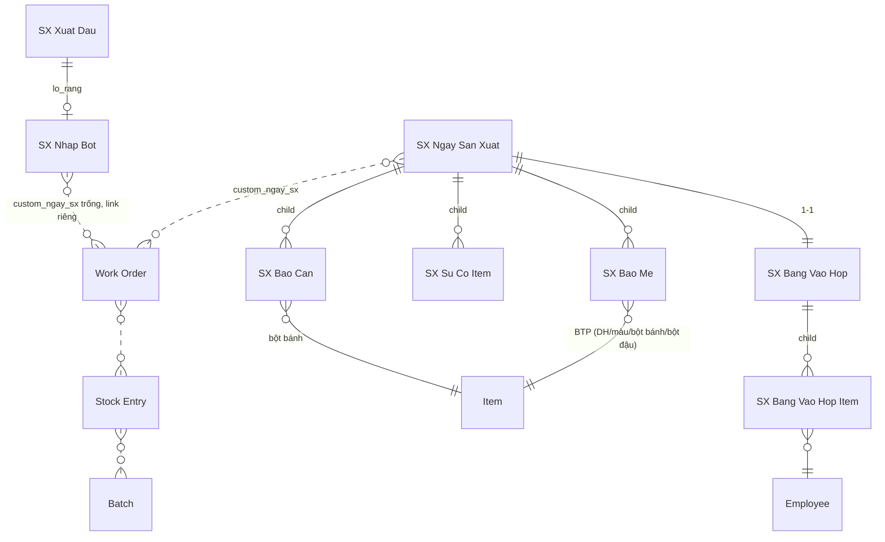

# CODER PACK v3 — App `sx` (Portal Sản Xuất RVHG, route `/sx`)

> **Handoff cho Claude Code. Bản v3 — THAY THẾ HOÀN TOÀN v1/v2.** Build theo phương pháp
> nextcode + skills: `frappe-app-build-profile` (kiểu NPP) → `nextcode-build` →
> `frappe-portal-spa` → `frappe-app-shipping-gotchas`. Site: `a.rongvanghoanggia.com`
> (Frappe/ERPNext v16). **Đọc hết file này trước khi gõ lệnh đầu tiên.**
>
> Triết lý: **công nhân 0 chạm tuyệt đối — 2 người QC nhập toàn bộ số liệu** bằng cách đi
> vòng hỏi miệng. Truy xuất mức **NGÀY × LOẠI** (chủ đầu tư đã quyết có ý thức). FIFO tự động
> toàn tuyến — **không ai chọn lô ở bất kỳ đâu**.
>
> Định mức nguồn: workbook `RVHG_dinh_muc_BOM_v6.xlsx` (16/16 câu hỏi đã chốt).
> Item + BOM do chủ đầu tư TỰ NHẬP trên Desk trước khi ship (Phase 0).

---

## 0. Build brief

```
# Build brief — sx (v3)
Nền tảng: Frappe/ERPNext v16 custom app, theo phương pháp nextcode.
1. Domain:      Số hoá + truy xuất nguồn gốc sản xuất RVHG — 2 nhánh: BÁNH đậu xanh
                (8 loại ruột, ủ 24h, cán/viên/gói, vào hộp) và BỘT đậu (8 công thức,
                trộn xong đóng túi/hộp). Pipeline lệch ngày: xuất đậu D-1, rang D,
                nghiền D+1. 1 dây chuyền, 1 ca. Người nhập: 2 QC (ghi số + vào hộp).
2. DocType:     6 DocType mới prefix `SX` + 4 child + custom fields (fixtures).
3. Vai trò:     3 role: SX Ghi So / SX Vao Hop / SX Quan Ly. Method-mediated,
                guard role dòng đầu mọi whitelisted method.
4. Giao diện:   Portal SPA `/sx` (www page), vanilla JS no-build, hash router,
                import map cache-bust, CSS prefix `sx-`, tablet-first, nút to, numpad.
                Màn hình lắp từ CARD theo role (chuyển giao sau này = đổi config).
5. Analytics:   Dashboard: sản lượng SKU, năng suất/người, tiến độ cán vs trộn,
                tồn BTP + cảnh báo âm, truy xuất lô 2 chiều.
6. Ràng buộc:   Backend = Python whitelisted method trong app (KHÔNG Server/Client
                Script); fieldname ASCII (item name tiếng Việt theo quy ước site);
                fixtures export; py_compile + node --check + validator 0 ERROR;
                commit-per-feature (P0..P7); đọc source Frappe/ERPNext thật khi nghi ngờ.
7. Git:         push nhánh dev (+ default nếu được phép).
```

---

## 1. Quyết định kiến trúc (ĐÃ CHỐT qua ~12 vòng với chủ đầu tư — KHÔNG tự ý đổi)

| # | Quyết định | Hệ quả |
|---|---|---|
| D1 | **2 nhánh sản phẩm, BOM 3 tầng.** T1: Đỗ (xanh/đen) → Bột đỗ nền · Đường → Đường hoán (3 biến thể) · Hỗn hợp màu (2 loại). T2 nhánh bánh: bột đỗ + đường hoán + gluco + dầu + hương/phụ liệu → **Bột bánh (8 loại, mẻ ~114kg)**. T2 nhánh bột: bột đỗ + đường + phụ liệu → **Bột đậu các loại (8 công thức, mẻ 40kg; chè đậu đen 46.05kg)**. T3: → TP SKU (bánh hộp / bột túi-hộp) — **chủ đầu tư tự tạo BOM T3 trên Desk**. | Định mức chi tiết trong workbook v6 |
| D2 | **KHÔNG khai item trung gian ngoài danh mục BTP.** Đỗ rang / đỗ vỡ / **bánh rời** = WIP vô hình. Nguyên tắc: chỉ khai ở chỗ rẽ nhánh hoặc tồn lâu. | Tồn giữa chừng lệch hình thái, không lệch lượng — kiểm kê định kỳ chỉnh |
| D3 | **Truy xuất mức NGÀY × LOẠI.** Không thùng ủ / mẻ cá thể. Báo tổng số mẻ mỗi loại. | Thu hồi theo lô-ngày (hợp lệ ISO). Ủ 24h người tự canh |
| D4 | **Xuất kho theo định mức BOM × số mẻ** (hao trộn không đáng kể — CH-08). Trôi số → Stock Reconciliation định kỳ trên Desk. | Không đo hao realtime |
| D5 | **FIFO tự động toàn tuyến — không ai chọn lô.** Đậu, đường, dầu, bột nền, đường hoán, bột bánh/bột đậu: hệ thống tự pick batch cũ nhất khi trừ kho. Lô NCC được neo vào truy xuất tại thời điểm trừ. | Điều kiện: Purchase Receipt nhập NVL PHẢI có batch (kỷ luật Phase 0) |
| D6 | **Xuất đậu nhập thẳng SỐ KG** (không số bao, không chọn lô). Sinh mã lô rang từ ngày rang. | `SX Xuat Dau` tối giản |
| D7 | **Đậu trừ kho tại bước NHẬP BỘT** (phương án B — GATE-C cũ đã tự chốt): `SX Nhap Bot` chạy Manufacture T1 trừ đậu FIFO, nhập bột Kho BTP. Không còn chỗ nào khác trừ đậu. | GATE-C xoá khỏi danh sách gate |
| D8 | **Báo cán = số theo dõi tiến độ, KHÔNG phải chứng từ kho** (hệ quả bỏ bánh rời). Bột bánh bị trừ khi TP vào hộp (backflush). Lệch thời điểm trộn↔hộp vài ngày là chấp nhận. | Bỏ `SX May`, bỏ công suất theo máy (chủ đầu tư xác nhận "tạm thời chưa chi tiết được") |
| D9 | **Người nhập = 2 QC, 2 màn hình.** QC#1 "Vòng ghi số": xuất đậu, nhập bột, báo mẻ (nấu đường/màu + trộn 2 nhánh), báo cán, sự cố. QC#2 "Vào hộp": bảng vào hộp theo người + Chốt ngày. Công nhân + thủ kho + tổ trưởng: 0 chạm, chỉ trả lời miệng. | Rủi ro độc lập đã cân nhắc — xem §2.1 |
| D10 | **App `sx` thuần vận hành. Bánh 0 CCP** (đúng HACCP hiện hành), không gán nhãn CCP ở đâu. Ghi nhiệt độ rang, thẩm tra mối hàn, SSOP, NCR → app `iso` (QC độc lập) làm sau, link một chiều iso→sx. | Không build gì thuộc thẩm tra trong pack này |
| D11 | **Mọi WO + SE Manufacture sinh bằng code với số thực tế, `skip_transfer=1`.** `SX Nhap Bot` sinh ngay khi ghi; các mẻ (bao_me) + TP sinh lúc Chốt ngày. Không Material Transfer, không WIP lơ lửng. | |
| D12 | **1 ca** — không field ca. | |
| D13 | **Mã lô hiển thị TO trên màn hình để ghi tay ra thẻ.** Không bắt buộc máy in. Batch sinh trong code: `{custom_batch_prefix}-{DDMMYY}`, trùng → `-2`. | QR/in tem = Phase 2 |
| D14 | **Không Job Card / Routing / operations.** Không Server/Client Script. | |
| D15 | Item name theo **quy ước site: tiếng Việt có dấu, ID = tên** (đã xác minh bằng ảnh Item list). Fieldname DocType vẫn ASCII. Nước = item **Maintain Stock 0**, vẫn nằm trong BOM để cân bằng khối lượng. | |
| D16 | Cột `custom_nl_tron` trong workbook **không dùng nữa** (bỏ màn công thức chi tiết theo mẻ) — không tạo custom field này. | |

### Sơ đồ dòng chảy + truy xuất

```
D-1 chiều : QC#1 ghi XUẤT ĐẬU (kg, loại đỗ) ──► mã lô rang R-DDMMYY / RD-DDMMYY (ghi thẻ)
D         : luộc → rang → ủ nguội                                  (0 thao tác)
D+1       : vỡ → nghiền → QC#1 tap NHẬP BỘT lô R
            ⇒ code: WO+SE Manufacture T1 — trừ Đỗ FIFO (neo lô NCC), nhập Bột đỗ nền
              vào Kho BTP, batch = R-DDMMYY
Bất kỳ    : nấu đường hoán / hỗn hợp màu — QC#1 ghi vào BÁO MẺ (loại + số mẻ)
Ngày X    : trộn — QC#1 ghi BÁO MẺ (8 bột bánh / 8 bột đậu, số mẻ); cán — QC#1 ghi BÁO CÁN
Ngày X..  : vào hộp/túi — QC#2 ghi BẢNG VÀO HỘP (người × SKU × phương thức × số hộp)
Cuối ngày : QC#2 tap CHỐT NGÀY ⇒ code sinh toàn bộ WO/SE/Batch theo thứ tự phụ thuộc,
            trừ kho FIFO, đổ SalaryProduct
```

Chuỗi truy xuất (2 chiều, dùng Serial & Batch Traceability Report chuẩn v16):
`Batch TP → SE T3 → Batch bột bánh/bột đậu (loại-ngày) → SE T2 → Batch bột đỗ nền (= lô R)
+ Batch đường hoán → SE T1 → lô đậu NCC / lô đường NCC`.

---

## 2. Con người & điểm nhập

| Ai | Màn hình | Làm gì | Bao nhiêu lần/ngày |
|---|---|---|---|
| **QC #1** (role `SX Ghi So`) | `#/ghiso` — checklist vòng ghi số | Xuất đậu (kg + loại đỗ, chiều D-1) · Nhập bột (tap lô chờ) · Báo mẻ nấu (đường hoán/màu) · Báo mẻ trộn (bột bánh/bột đậu) · Báo cán · Sự cố | ~5–7 chặng, mỗi chặng 1–2 con số |
| **QC #2** (role `SX Vao Hop`) | `#/vaohop` | Bảng vào hộp theo người × SKU × phương thức · Sự cố · **Chốt ngày** | 1 phiên cuối ca |
| **Quản lý** (role `SX Quan Ly`) | tất cả + `#/quanly` | Dashboard, truy xuất, sửa/huỷ, kiểm kê (Desk) | khi cần |
| Thủ kho, tổ trưởng, công nhân | — | **0 chạm.** Trả lời miệng cho QC | 0 |

### 2.1 Tính độc lập (rủi ro đã cân nhắc — ghi vào README của app)

Người nhập số liệu sản xuất là QC — chủ đầu tư đã quyết, chấp nhận rủi ro vai trò kép, với
2 điều kiện giảm thiểu: (1) **2 QC tách vai** (ghi số ≠ vào hộp/chốt); (2) **người thẩm tra
hồ sơ bên app `iso` sau này KHÔNG được là người đã nhập số bên `sx`**. App phải bảo đảm bằng
chứng: mọi DocType `SX *` bật `track_changes`, không dùng tài khoản chung — mỗi QC 1 user
thật (`ghiso@rvhg`, `vaohop@rvhg`). Lộ trình dài hạn: chuyển dần từng card về đúng tổ sản
xuất (xem §6.2 role→card).

---

## 3. DocType Blueprint

**App:** `sx` · **Module:** `SX` · Fieldname ASCII. Label tiếng Việt.

### ERD



### 3.1 `SX Xuat Dau` — phiếu xuất đậu → sinh lô rang (neo gốc)

- Naming: `SXXD-.YYYY.-.#####` · **Submittable: Yes** · Title: `lo_rang` · track_changes

| Fieldname | Label | Type | Notes |
|---|---|---|---|
| ngay_xuat | Ngày xuất (D-1) | Date | reqd, default today |
| ngay_rang | Ngày rang (D) | Date | reqd, default today+1 |
| loai_dau | Loại đỗ | Link Item | reqd; portal lọc = RM đỗ trong BOM BTP-Bot; default đỗ xanh |
| dau_kg | Đậu xuất (kg) | Float | reqd, > 0, nhập thẳng kg |
| lo_rang | Mã lô rang | Data | read_only, code sinh `{prefix}-DDMMYY(ngay_rang)`; unique; hiển thị CỰC TO |
| trang_thai_bot | Đã nhập bột? | Check | read_only, =1 khi có SX Nhap Bot submitted |
| ghi_chu | Ghi chú | Small Text | |

Không tạo Stock Entry ở đây (đậu trừ tại Nhập bột — D7). Neo truy vết + nguồn list "lô chờ nhập bột".

### 3.2 `SX Nhap Bot` — nhập bột lô R (chạy Manufacture T1)

- Naming: `SXNB-.YYYY.-.#####` · **Submittable: Yes** · Title: `lo_rang` · track_changes

| Fieldname | Label | Type | Notes |
|---|---|---|---|
| ngay_nhap | Ngày nhập | Date | reqd, default today |
| xuat_dau | Phiếu xuất đậu | Link SX Xuat Dau | reqd; list = submitted, trang_thai_bot=0, ngay_rang<=today |
| lo_rang | Mã lô rang | Data | fetch, read_only |
| item_bot | Item bột | Link Item | read_only, suy từ loai_dau (BOM BTP-Bot có loai_dau là RM) |
| bot_kg | Bột nhập (kg) | Float | read_only = dau_kg × yield(BOM item_bot); KHÔNG cân |
| wo / se / batch_bot | WO / SE / Batch | Link | read_only, set khi submit |

**on_submit (controller):** Batch (batch_id=lo_rang, item=item_bot) → WO (item_bot, qty=bot_kg,
skip_transfer=1) submit → SE Manufacture: RM=đậu FIFO Kho NVL (neo lô NCC), FG=bột vào Kho BTP →
set links + trang_thai_bot=1 trên phiếu xuất. **on_cancel:** SE → WO, reset trang_thai_bot.
Thiếu tồn đậu → chặn rõ.

### 3.3 `SX Ngay San Xuat` — phiếu ngày (xương sống)

- Naming: `SXN-.YYYY.-.MM.-.DD.-.##` · **Submittable: Yes** · Title: `ngay` · track_changes
- validate: 1 doc docstatus<2 / ngày. Submit CHỈ qua `chot_ngay` (before_submit chặn).

| Fieldname | Label | Type | Notes |
|---|---|---|---|
| ngay | Ngày | Date | reqd, default today |
| trang_thai | Trạng thái | Select `Đang chạy\nĐã chốt\nĐã huỷ` | read_only |
| bao_me | Báo mẻ (nấu + trộn) | Table SX Bao Me | QC#1 |
| bao_can | Báo cán (theo dõi) | Table SX Bao Can | QC#1 — KHÔNG sinh chứng từ kho (D8) |
| su_co | Sự cố | Table SX Su Co Item | |
| tong_hop_tp / tong_luong_sp | Tổng hộp / lương | Int / Currency | read_only, khi chốt |
| ds_wo_se | WO/SE đã sinh | Small Text | log, phục vụ cancel |
| ghi_chu | Ghi chú | Small Text | |

**Child `SX Bao Me`:** item_btp (Link Item, filter custom_sx_nhom in BTP-Phu/BTP-Banh/BTP-Bot-SP,
reqd) · so_me (Float, reqd, >0, cho 0.5) · co_me_kg (Float, read_only, fetch BOM.custom_co_me_chuan_kg)
· tong_kg (Float, read_only = so_me × co_me_kg) · batch/wo/se (Link, read_only, set khi chốt).

**Child `SX Bao Can`:** item_bot_banh (Link Item, filter BTP-Banh) · so_me (Float, reqd) · ghi_chu (Data).

**Child `SX Su Co Item`:** thoi_diem (Datetime, default now) · loai (Select) · mo_ta (Small Text) · phut_dung (Int).

**on_cancel** (chỉ Quan Ly): đọc ds_wo_se, huỷ ngược (SE T3 → WO T3 → SE mẻ → WO mẻ), xoá
SalaryProduct. KHÔNG đụng SX Nhap Bot (độc lập).

### 3.4 `SX Bang Vao Hop` — sản lượng TP + lương (cả 2 nhánh)

- Naming: `VH-.YYYY.-.#####` · **Submittable: Yes** · 1 doc docstatus<2 / ngay_sx · track_changes
- ngay_sx (Link, reqd) · dong (Table SX Bang Vao Hop Item, reqd) · tong_hop/tong_tien (read_only).

**Child `SX Bang Vao Hop Item`:** nhan_vien (Link Employee, reqd) · san_pham (Link Item filter TP,
reqd) · phuong_thuc (Select `Thủ công\nMáy hỗ trợ`, reqd) · so_hop (Int, reqd, >0) · don_gia/thanh_tien
(read_only, lookup server-side).

### 3.5 `SX Don Gia Vao Hop` — bảng giá lương

phuong_thuc (reqd) · san_pham (optional, trống = mọi SP) · don_gia (Currency, reqd, **cho phép 0**)
· hieu_luc_tu (Date, reqd). Lookup: (san_pham, phuong_thuc) → fallback (trống, phuong_thuc) →
hieu_luc_tu max ≤ ngày. Không có bản ghi nào → chặn, báo rõ.

### 3.6 `SX Settings` — Single

cong_ty (Link Company) · kho_nvl · kho_btp · kho_tp (Link Warehouse). Hết — yield từ BOM,
prefix từ Item, không ngưỡng CCP (D10).

### 3.7 Custom Fields (fixtures, module SX)

| DocType | Fieldname | Type | Options |
|---|---|---|---|
| Item | custom_sx_nhom | Select | `\nNVL\nBTP-Bot\nBTP-Phu\nBTP-Banh\nBTP-Bot-SP\nTP\nBao Bi` |
| Item | custom_batch_prefix | Data | R, RD, DH, DHK, DHC, HMD, HMV, BB-TT…, BDS…, + prefix TP |
| BOM | custom_co_me_chuan_kg | Float | bánh ~114 · bột 40 · chè 46.05 · ĐH 50/51.1/50.25 · màu 11.13/3.3 |
| Work Order | custom_ngay_sx | Link SX Ngay San Xuat | trống với WO của Nhập bột |
| Stock Entry | custom_ngay_sx | Link SX Ngay San Xuat | |
| Batch | custom_ngay_sx | Link SX Ngay San Xuat | batch bột nền tra ngược qua SX Nhap Bot (batch_id = lô R) |

**KHÔNG tạo `custom_nl_tron`** (D16). **Mã batch (code sinh):** `{Item.custom_batch_prefix}-{DDMMYY}`;
trùng → `-2`. Bột nền: batch_id = mã lô rang (prefix R/RD + ngày rang).

---

## 4. Permission Matrix

Roles (fixtures): `SX Ghi So`, `SX Vao Hop`, `SX Quan Ly`.

| DocType | SX Ghi So | SX Vao Hop | SX Quan Ly |
|---|---|---|---|
| SX Xuat Dau | R W C Submit | R | + Cancel Amend |
| SX Nhap Bot | R W C Submit | R | + Cancel Amend |
| SX Ngay San Xuat | R W C (KHÔNG submit) | R W C Submit (qua chot_ngay) | + Cancel Amend |
| SX Bang Vao Hop | R | R W C Submit | + Cancel Amend |
| SX Don Gia Vao Hop | R | R | R W C Delete |
| SX Settings | R | R | R W |

- System Manager: full. **KHÔNG DocPerm** cho 2 role QC trên Employee/WO/SE/Batch/SalaryProduct —
  method-mediated, chỉ trả field whitelist (Employee: name, employee_name).
- User thật: `ghiso@rvhg`, `vaohop@rvhg`. Không tài khoản chung (§2.1).

---

## 5. Backend Plan

### 5.1 Touch points ERPNext core

- **BOM**: chủ đầu tư tự nhập (Phase 0). Code CHỈ ĐỌC: yield T1 = qty bột/qty đỗ; cỡ mẻ =
  custom_co_me_chuan_kg; backflush theo BOM lines.
- **Manufacturing Settings** (Phase 0): Backflush Based On = BOM; Overproduction 5%; tắt capacity.
- **WO/SE**: make_stock_entry(wo, "Manufacture", qty) rồi chỉnh. Non-stock item (Nước,
  is_stock_item=0) **tự động loại khỏi SE** (get_bom_items_as_dict include_non_stock_items=False
  → WHERE is_stock_item in (1,1)) — không sinh ledger, không vỡ. Đã đối chiếu source v16.
- **FIFO pick**: use_serial_batch_fields=1 + batch_no theo batch cũ nhất; 1 lần trừ tách nhiều batch.
- **SalaryProduct**: **GATE-B** — in field list từ console, chốt mapping, xin custom field nếu
  thiếu phuong_thuc. Code dùng mapping adaptive tới khi chốt.

### 5.2 hooks.py

```python
doc_events = {
    "SX Ngay San Xuat": {"on_cancel": "sx.api.chot.on_cancel_ngay"},
    "SX Nhap Bot": {"on_submit": "sx.api.tang1.on_submit_nhap_bot",
                     "on_cancel": "sx.api.tang1.on_cancel_nhap_bot"},
}
fixtures = [Role(Ghi So/Vao Hop/Quan Ly), Custom Field module SX, Print Format module SX]
```
Không scheduler, không override class, không Server/Client Script.

### 5.3 Whitelisted API (portal.py / tang1.py / chot.py) — guard theo card-capability

| Method | Card/Role | Làm gì |
|---|---|---|
| portal.get_boot | cả 3 | context: views+viewCards theo role, phiếu ngày, danh mục (2 đỗ, BTP theo nhóm, TP), lô chờ nhập bột, tồn BTP |
| tang1.xuat_dau(loai_dau, dau_kg, ngay_rang) | Ghi So | tạo+submit → trả lo_rang |
| tang1.nhap_bot(xuat_dau) | Ghi So | tạo+submit (WO+SE T1 trong on_submit) → trả lo_rang, bot_kg |
| portal.get_or_create_ngay(ngay) | Ghi So, Vao Hop | phiếu ngày draft |
| portal.bao_me(ngay_sx, rows) | Ghi So | upsert child bao_me |
| portal.bao_can(ngay_sx, rows) | Ghi So | upsert child bao_can |
| portal.ghi_su_co(...) | Ghi So, Vao Hop | append sự cố |
| portal.luu_bang_vao_hop(ngay_sx, rows) | Vao Hop | upsert draft, đơn giá server |
| chot.chot_ngay(ngay_sx) | Vao Hop, Quan Ly | orchestrator §5.4 |
| portal.dashboard(tu_ngay, den_ngay) | Quan Ly | KPI |
| portal.truy_xuat(batch_tp) | Quan Ly | chuỗi ngược TP → mẻ → lô R → lô NCC |

### 5.4 `chot_ngay` — trình tự bắt buộc

1. **Validate** (idempotent): docstatus=0; ít nhất một trong {bao_me có dòng, vào hộp có dòng};
   mọi dòng vào hộp có đơn giá; kiểm đủ tồn TRƯỚC khi sinh chứng từ (thiếu → liệt kê item+kg).
2. **Topo sort bao_me theo phụ thuộc BOM** (A là RM trong BOM(B) → A trước): màu → đường hoán →
   bột bánh/bột đậu.
3. **Từng dòng bao_me:** qty=so_me×co_me_kg → Batch {prefix}-DDMMYY → WO (skip_transfer,
   custom_ngay_sx) → SE Manufacture (RM backflush FIFO: bột nền=lô R, đường/dầu/màu/ĐH; FG vào
   Kho BTP) → set batch/wo/se.
4. **Submit SX Bang Vao Hop** (nếu có).
5. **Từng SKU vào hộp:** qty=Σso_hop → Batch TP → WO+SE (RM bột bánh/bột đậu FIFO Kho BTP +
   bao bì Kho NVL; FG Kho TP).
6. **SalaryProduct**: 1 bản ghi/dòng (GATE-B). Đơn giá 0 vẫn tạo (thống kê).
7. Tổng hợp + ds_wo_se → flags.tu_chot_ngay=True → submit.
8. try/except toàn khối → rollback + message rõ bước hỏng.

**Cảnh báo mềm (không chặn, trả sau khi chốt):** tồn bột bánh loại < lượng cán luỹ kế (quên báo mẻ).

### 5.5 Kho: Kho NVL → Kho BTP (bột nền lô R, ĐH, màu, 8 bột bánh, 8 bột đậu batch loại-ngày) → Kho TP.
Đậu nằm sổ Kho NVL tới Nhập bột (D7).

---

## 6. Portal SPA `/sx` (skill frappe-portal-spa — LUẬT VÀNG #1)

```
sx/www/sx.py sx.html          # SX_CONTEXT (views, viewCards, landing); importmap cache-bust
sx/public/sx/
  shell.js                    # hash router, nav theo views, landing theo role
  lib/ api.js router.js dom.js format.js
  components/ toast.js modal.js numpad.js
  cards/ xuatdau.js nhapbot.js baome.js baocan.js vaohop.js suco.js chotngay.js
  views/ ghiso.js vaohop.js quanly.js   # view = tổ hợp cards (lấy từ viewCards)
  shell.css                   # 100% prefix sx-
```

UX cứng: ≥18px, ≥48px, numpad tự dựng, ≤3 chạm, chốt ngày modal 2 bước, banner đỏ mất mạng,
**mã lô cực to + nút "Đã ghi thẻ"**, SKU picker search + nhóm Bánh/Bột + gần đây.

### 6.1 Định tuyến theo vai trò (server guard là chốt, ẩn tab chỉ tiện dụng)
Hash rỗng → landing. Route lạ → landing + toast.
```python
ROLE_VIEWS = {"SX Ghi So": ["ghiso"], "SX Vao Hop": ["vaohop"],
              "SX Quan Ly": ["ghiso", "vaohop", "quanly"]}  # + System Manager: đủ
```

### 6.2 Role → Card (đường chuyển giao tương lai — đổi config, không sửa UI/API)
```python
VIEW_CARDS = {"ghiso": ["xuatdau","nhapbot","baome","baocan","suco"],
              "vaohop": ["vaohop","suco","chotngay"], "quanly": ["quanly"]}
CARD_ROLES = {card: [roles cho phép gọi API card đó]}  # nguồn cấu hình chung sx/config/roles.py
```

### 6.3 Views
| View | Route | Nội dung |
|---|---|---|
| Ghi số | `#/ghiso` | Xuất đậu (2 nút loại đỗ + numpad kg → mã lô R TO) · Nhập bột (list lô chờ) · Báo mẻ (3 tab: Nấu/Bột bánh/Bột đậu) · Báo cán · Sự cố. Badge Đã ghi/Chưa. |
| Vào hộp | `#/vaohop` | Grid CN → SKU picker (search+nhóm+gần đây) → phương thức → numpad hộp → auto-save; footer tổng; Sự cố; nút CHỐT NGÀY (modal 2 bước). |
| Quản lý | `#/quanly` | 7/30 ngày: sản lượng SKU, lương/người, mẻ trộn vs cán, tồn BTP (đỏ nếu âm), phút dừng; Truy xuất batch TP; link Desk. |

---

## 7. Print Formats (fixtures, module SX)
1. **`SX Phieu Xuat Dau`** — mã lô R cực to, loại đỗ, kg, ngày rang, ô ký.
2. **`SX Nhat Ky Ngay`** — báo mẻ, báo cán, bảng vào hộp, sự cố, tổng hợp, ô ký 2 QC + quản đốc.

---

## 8. Phase 0 — dữ liệu nền (SEED BÁN TỰ ĐỘNG + phần làm tay)

App **ship sẵn định mức** trong `sx/seed/` (sinh tự động từ workbook, nguồn lưu tại
`docs/RVHG_dinh_muc_BOM_v3.xlsx`). Sau khi có Company + 3 Warehouse + `SX Settings`:

```bash
bench --site a.rongvanghoanggia.com execute sx.seed.seed_all --kwargs "{'dry_run': 1}"  # xem trước
bench --site a.rongvanghoanggia.com execute sx.seed.seed_all                            # ghi thật
```

Seed tạo **54 Item** (31 NVL + Nước `is_stock_item=0` + 2 bột nền + 5 đường hoán/màu + 8 bột
bánh + 8 bột đậu) với `custom_sx_nhom` nhóm chi tiết + `custom_batch_prefix` + `has_batch_no`
(`create_new_batch=0` — mã lô luôn đặt tường minh), và **23 BOM tầng 1/2** theo đúng thứ tự phụ
thuộc (topo: hỗn hợp màu → đường hoán màu → bột bánh/bột đậu), submit + `is_active/is_default`,
điền `custom_co_me_chuan_kg` cho đúng **21 loại được báo mẻ**. Idempotent — chạy lại chỉ bỏ qua,
không ghi đè số người dùng đã sửa tay.

> **KHÔNG ship BOM qua `fixtures/`**: fixtures import theo alphabet, full validate, không kiểm
> soát thứ tự phụ thuộc, BOM lại là doctype submittable → rất dễ chết `install-app`.

**Vẫn phải làm TAY (workbook chưa có / câu hỏi chưa chốt):**
1. **BOM tầng 3 + Item TP + bao bì** — CH-13 chưa có danh sách 40–50 SKU. **Đây là phần CHẶN**:
   chưa có BOM T3 thì không chốt ngày được nhánh TP (mẹo: 1 SKU chuẩn mỗi ruột rồi Duplicate).
2. Manufacturing Settings: Backflush = **BOM**, Overproduction 5%, tắt capacity planning,
   **GIỮ TẮT "Validate Components Quantities Per BOM"** (xung đột FIFO tách lô).
3. **Purchase Receipt NVL PHẢI có batch = lô NCC** (điều kiện của D5 FIFO-truy-xuất).
4. Tồn đầu: Stock Reconciliation (batch khởi tạo `TON-DDMMYY`).
5. `SX Don Gia Vao Hop` (2 phương thức); user `ghiso@rvhg`, `vaohop@rvhg` + gán role.
6. Câu hỏi còn treo ảnh hưởng số liệu: **CH-04** (Sữa dừa vs Bột sữa dừa; Rau má vs Bột rau má —
   đang khai 2 item riêng), **CH-09** (bột đậu đen tự nghiền hay mua sẵn — seed tạo BOM giả định
   hiệu suất 0.78 như đỗ xanh, có cảnh báo), CH-07/08/10/11/12.

> Custom Fields ship qua fixtures — deploy app (P2) TRƯỚC, rồi mới chạy seed.

---

## 9. Build order
P0 scaffold → P1 DocType + controllers → P2 fixtures (migrate cho Phase 0) → P3 config/roles.py +
tang1.py + portal.py + chot.py (sau GATE-B) → P4 portal card-based → P5 print → P6 verify → P7 deploy + acceptance §10.

## 10. Acceptance test (Contract)
1. Xuất đậu: Đỗ xanh 1000kg ngày rang mai → lo_rang R-{mai} to; + Đỗ đen 200kg → RD-.
2. Nhập bột: tap lô R → WO+SE T1: đậu FIFO đúng lô NCC, bột +780kg Kho BTP batch=R (yield từ BOM);
   trang_thai_bot=1; lô biến khỏi list.
3. Báo mẻ: 2 ĐH thường + 1 HM đỏ + 1 ĐH khoai môn + 3 Bột bánh truyền thống + 2 Bột đậu sữa dừa;
   Báo cán: 2 truyền thống; Vào hộp: 5 CN × 3 SKU × 2 phương thức.
4. Chốt ngày → topo: HM đỏ TRƯỚC ĐH khoai môn; mỗi bao_me có WO+SE batch đúng, tồn Kho BTP đúng;
   bột nền FIFO đúng lô R; SKU batch TP đúng, tồn Kho TP=Σhộp, bao bì trừ; Nước non-stock không lỗi;
   SalaryProduct đúng; phiếu submitted, ds_wo_se đủ.
5. Truy xuất(batch TP bánh): TP → Bột bánh-{ngày} → lô R → lô đậu NCC (+ nhánh ĐH → lô đường NCC).
6. Cancel phiếu ngày → SE/WO chốt huỷ ngược, SalaryProduct xoá, tồn về; SX Nhap Bot KHÔNG đụng.
7. Biên quyền: ghiso không thấy vaohop, gọi chot_ngay bị chặn; vaohop không sửa bao_me; route lạ → landing.
8. Edge: chỉ báo mẻ (skip T3+lương); chỉ vào hộp (skip mẻ); thiếu tồn → chặn liệt kê; chốt lần 2 → báo đã chốt; cảnh báo cán>tồn.
9. Portal: refresh ăn bản mới; CSS prefix sx-; numpad; mã lô to; SKU picker search.

## 11. Ngoài scope Phase 1
Toàn bộ app `iso` (thẩm tra CCP mối hàn, nhiệt rang, SSOP, HACCP version, NCR/CAPA, giữ/thả lô);
self-check 1kg đầu; thùng ủ cá thể + khoá 24h; cân thực từng mẻ; công suất theo máy (SX May đã bỏ);
QR/tem; IoT; offline; Telegram; Plant Floor; kiểm kê trong portal.

## 12. Gate duy nhất còn lại
- **GATE-B** (trước bước 6 chot_ngay): schema SalaryProduct — in field list, chốt mapping, xin
  custom field nếu thiếu phuong_thuc.
> GATE-A (định mức) = workbook v6 + chủ đầu tư tự nhập Phase 0. GATE-C = phương án B (D7). Còn lại build thẳng.
