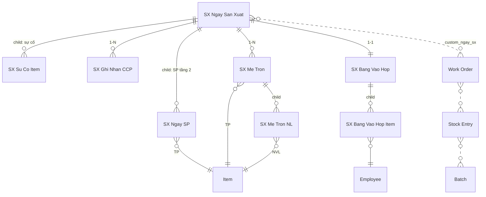

# CODER PACK — App `sx` (Portal Sản Xuất RVHG, route `/sx`)

> **Handoff cho Claude Code.** Build theo phương pháp nextcode + skills:
> `frappe-app-build-profile` (kiểu NPP) → `nextcode-build` → `frappe-portal-spa` → `frappe-app-shipping-gotchas`.
> Site: `a.rongvanghoanggia.com` (Frappe/ERPNext v16). Đọc hết file này trước khi gõ lệnh đầu tiên.

---

## 0. Build brief

```
# Build brief — sx
Nền tảng: Frappe/ERPNext v16 custom app, theo phương pháp nextcode.

1. Domain:      Số hoá sản xuất bánh & bột đậu xanh RVHG. 1 dây chuyền, 1 ca.
                Công nhân lowtech → công nhân 0 chạm; tổ trưởng vận hành 1 tablet
                (+ tuỳ chọn 1 tablet cố định trạm rang). Đơn vị ghi nhận: NGÀY + MẺ TRỘN,
                không theo người — trừ công đoạn VÀO HỘP (lương sản phẩm theo người).
2. DocType:     6 DocType mới prefix `SX` + 4 child table + custom fields trên
                BOM/BOM Item/Item/Work Order/Stock Entry/Batch (fixtures).
3. Phân quyền:  3 role: SX To Truong / SX Tram Rang / SX Quan Ly. Method-mediated,
                guard role ở dòng đầu mọi whitelisted method.
4. Giao diện:   Portal SPA `/sx` (www page), vanilla JS no-build, hash router,
                import map cache-bust, CSS prefix `sx-`, tablet-first, nút to, numpad.
5. Analytics:   Dashboard quản lý: sản lượng, yield, % CCP đạt, năng suất vào hộp/người.
6. Ràng buộc:   Backend = Python whitelisted method trong app (KHÔNG Server/Client Script);
                fieldname ASCII; fixtures export; py_compile + node --check + validator
                0 ERROR; commit-per-feature (P0..P7).
7. Git:         push nhánh dev (+ default nếu được phép).
```

## 1. Quyết định kiến trúc (đã chốt với Chiến — KHÔNG tự ý đổi)

| # | Quyết định |
|---|---|
| D1 | **BOM 2 tầng.** BTP Bột nguyên chất là Item riêng, có tồn kho qua ngày, Batch riêng. Tầng 1: Đậu xanh → [Rang → Nghiền → Sàng] → BTP Bột. Tầng 2: BTP Bột + phụ liệu → [Trộn → …] → TP (bột hộp hoặc bánh). |
| D2 | **Không Job Card / Routing / operations trong BOM.** Hồ sơ công đoạn = DocType `SX *`. |
| D3 | **Backflush NVL theo BOM.** Mẻ trộn là hồ sơ chất lượng (prefill định mức, xác nhận 1 tap); lệch chỉ ghi nhận + cảnh báo, không sửa kho realtime. Trôi số → kiểm kê BTP định kỳ (Stock Reconciliation, làm tay trên Desk). |
| D4 | **Đo lường tối thiểu:** BTP = số bao đậu vào × yield (suy từ BOM tầng 1). TP = tổng bảng vào hộp. Giữa chuỗi không cân. |
| D5 | **Rang là dòng chảy liên tục, KHÔNG có mẻ rang.** Giám sát CCP = ghi nhận định kỳ (nhiệt độ theo tần suất cấu hình), không gắn theo mẻ. |
| D6 | **Vào hộp:** đơn vị = hộp; đơn giá lương phụ thuộc **phương thức** (Thủ công / Máy hỗ trợ), không phụ thuộc SKU (nhưng bảng giá cho phép override theo SKU nếu sau này cần). |
| D7 | App `sx` đứng độc lập, không import từ `iso22000_fsms`. ISO bản viết lại sẽ link vào `SX Ghi Nhan CCP` / `SX Me Tron` (một chiều ISO → SX). |
| D8 | **Mọi Work Order + Stock Entry sinh lúc CHỐT NGÀY với số liệu thực tế**, `skip_transfer = 1` (Manufacture entry rút NVL thẳng từ kho nguồn, không qua bước Material Transfer, không tồn WIP lơ lửng). Bỏ qua lợi ích stock-reservation trong ngày — chấp nhận vì 1 chuyền, quy mô nhỏ. |
| D9 | 1 ca → không có field ca ở bất kỳ đâu. |

**Chuỗi truy xuất ISO 22000 (8.3):** `Batch TP → Stock Entry → Work Order → SX Ngay San Xuat → {SX Ghi Nhan CCP, SX Me Tron, SX Bang Vao Hop}` qua custom field `custom_ngay_sx` gắn trên Batch/SE/WO. Truy xuất 2 chiều NVL↔TP dùng Serial & Batch Traceability Report chuẩn v16.

---

## 2. DocType Blueprint

**App:** `sx` · **Module:** `SX` · Mọi fieldname ASCII không dấu. Label tiếng Việt có dấu.

### ERD



### 2.1 DocType: `SX Ngay San Xuat` — phiếu ngày, xương sống

- Naming: naming_series `SXN-.YYYY.-.MM.-.DD.-.##` · **Is Submittable: Yes** · Track Changes: Yes
- Title Field: `ngay` · Search: `ngay,trang_thai` · Submit = "Chốt ngày"

| Fieldname | Label | Type | Options | Reqd | Notes |
|---|---|---|---|---|---|
| ngay | Ngày | Date | | ✓ | default today; **validate: duy nhất 1 doc docstatus<2 / ngày** |
| trang_thai | Trạng thái | Select | Đang chạy\nĐã chốt\nĐã huỷ | | read_only, sync theo docstatus |
| chay_tang_1 | Có rang bột hôm nay | Check | | | |
| so_bao_dau | Số bao đậu đưa vào | Int | | | depends_on chay_tang_1; mandatory_depends_on chay_tang_1 |
| kl_bao_kg | Khối lượng/bao (kg) | Float | | | default fetch SX Settings.kl_bao_dau_kg, sửa được |
| dau_vao_kg | Đậu đầu vào (kg) | Float | | | read_only = so_bao_dau × kl_bao_kg |
| btp_du_kien_kg | Bột dự kiến (kg) | Float | | | read_only = dau_vao_kg × yield từ BOM tầng 1 |
| san_pham_tang_2 | Sản phẩm đóng hộp hôm nay | Table | SX Ngay SP | | tổ trưởng tick lúc mở ngày; số liệu thực điền lúc chốt |
| su_co | Sự cố | Table | SX Su Co Item | | |
| — Section: Tổng hợp (read_only, điền khi chốt) — |
| btp_thuc_te_kg | Bột nhập kho (kg) | Float | | | = btp_du_kien_kg (D4) |
| wo_tang_1 | WO tầng 1 | Link | Work Order | | |
| se_tang_1 | SE tầng 1 | Link | Stock Entry | | |
| batch_btp | Batch bột | Link | Batch | | |
| tong_hop | Tổng hộp TP | Int | | | Σ bảng vào hộp |
| tong_luong_sp | Tổng lương sản phẩm | Currency | | | Σ bảng vào hộp |
| ghi_chu | Ghi chú | Small Text | | | |

**Child `SX Ngay SP`:** `san_pham` (Link Item, filter custom_sx_nhom='TP', reqd) · `so_hop_thuc_te` (Int, read_only, điền khi chốt) · `wo` (Link Work Order, read_only) · `se` (Link Stock Entry, read_only) · `batch_tp` (Link Batch, read_only).

**Child `SX Su Co Item`:** `thoi_diem` (Datetime, default now) · `loai` (Select: `Hỏng máy\nThiếu NVL\nMất điện\nChất lượng\nKhác`, reqd) · `mo_ta` (Small Text) · `phut_dung` (Int — dừng chuyền bao nhiêu phút, phục vụ OEE sau này).

**Submission rules:** Submit CHỈ qua method `chot_ngay` (controller `before_submit` chặn nếu `flags.tu_chot_ngay != True`). `on_cancel`: huỷ chuỗi ngược — SE tầng 2 → WO tầng 2 → SE tầng 1 → WO tầng 1 → xoá SalaryProduct đã sinh; Batch giữ nguyên (không xoá được khi đã có ledger — ghi chú vào ghi_chu).

### 2.2 DocType: `SX Ghi Nhan CCP` — sổ giám sát rang liên tục

- Naming: `CCP-.YYYY.-.#####` · Submittable: **No** (kiểu sổ log) · Track Changes: Yes

| Fieldname | Label | Type | Options | Reqd | Notes |
|---|---|---|---|---|---|
| ngay_sx | Phiếu ngày | Link | SX Ngay San Xuat | ✓ | |
| thoi_diem | Thời điểm | Datetime | | ✓ | default now |
| nhiet_do_c | Nhiệt độ (°C) | Float | | ✓ | |
| dat | Đạt | Check | | | read_only; auto so với SX Settings.ccp_nhiet_min/max trong `validate` |
| hanh_dong_khac_phuc | Hành động khắc phục | Small Text | | | mandatory_depends_on `eval:!doc.dat` |
| ghi_chu | Ghi chú | Small Text | | | |

Không sửa được sau 24h (`validate`: chặn update nếu creation > 24h, trừ SX Quan Ly) — kỷ luật hồ sơ CCP.

### 2.3 DocType: `SX Me Tron` — hồ sơ phối trộn theo mẻ

- Naming: `TRON-.YYYY.-.#####` · **Is Submittable: Yes** · Title: `san_pham`

| Fieldname | Label | Type | Options | Reqd | Notes |
|---|---|---|---|---|---|
| ngay_sx | Phiếu ngày | Link | SX Ngay San Xuat | ✓ | |
| me_so | Mẻ số | Int | | | read_only, auto đếm theo ngày_sx trong `before_insert` |
| san_pham | Sản phẩm | Link | Item | ✓ | filter custom_sx_nhom='TP' |
| bom | BOM | Link | BOM | | read_only, default BOM active của san_pham |
| co_me_kg | Cỡ mẻ (kg hỗn hợp) | Float | | ✓ | default BOM.custom_co_me_chuan_kg |
| nguyen_lieu | Nguyên liệu | Table | SX Me Tron NL | ✓ | prefill từ method |
| dung_cong_thuc | Đúng công thức | Check | | | read_only; =1 khi mọi dòng thuc_can==dinh_muc |
| tong_lech_pct | Tổng lệch (%) | Percent | | | read_only, Σ|lệch|/Σđịnh mức |

**Child `SX Me Tron NL`:** `item` (Link Item, reqd) · `dinh_muc_kg` (Float, read_only) · `thuc_can_kg` (Float, default = dinh_muc) · `lech_kg` (Float, read_only) · `lech_pct` (Percent, read_only) · `batch_no` (Link Batch, optional — ghi lô NVL nếu tổ trưởng scan/chọn; không bắt buộc phase 1).

`validate`: tính lệch; nếu `tong_lech_pct > SX Settings.me_tron_nguong_canh_bao_pct` → `frappe.msgprint` cảnh báo (không chặn).

### 2.4 DocType: `SX Bang Vao Hop` — lương sản phẩm công đoạn cuối

- Naming: `VH-.YYYY.-.#####` · **Is Submittable: Yes** · validate: 1 doc docstatus<2 / ngay_sx

| Fieldname | Label | Type | Options | Reqd | Notes |
|---|---|---|---|---|---|
| ngay_sx | Phiếu ngày | Link | SX Ngay San Xuat | ✓ | |
| dong | Chi tiết | Table | SX Bang Vao Hop Item | ✓ | |
| tong_hop | Tổng hộp | Int | | | read_only Σ so_hop |
| tong_tien | Tổng tiền | Currency | | | read_only Σ thanh_tien |

**Child `SX Bang Vao Hop Item`:** `nhan_vien` (Link Employee, reqd) · `san_pham` (Link Item, filter TP, reqd) · `phuong_thuc` (Select: `Thủ công\nMáy hỗ trợ`, reqd) · `so_hop` (Int, reqd, >0) · `don_gia` (Currency, read_only — lookup `SX Don Gia Vao Hop`) · `thanh_tien` (Currency, read_only = so_hop × don_gia).

### 2.5 DocType: `SX Don Gia Vao Hop` — bảng giá lương vào hộp

- Naming: `format:DG-{phuong_thuc}-{#####}` hoặc hash + title · Submittable: No

| Fieldname | Label | Type | Options | Reqd | Notes |
|---|---|---|---|---|---|
| phuong_thuc | Phương thức | Select | Thủ công\nMáy hỗ trợ | ✓ | |
| san_pham | Sản phẩm | Link | Item | | **để trống = áp dụng mọi SP** |
| don_gia | Đơn giá/hộp | Currency | ✓ | |
| hieu_luc_tu | Hiệu lực từ | Date | | ✓ | |

Lookup rule (viết 1 hàm dùng chung): match (san_pham, phuong_thuc) trước, fallback (san_pham trống, phuong_thuc), lấy bản `hieu_luc_tu` lớn nhất ≤ ngày SX. Không có giá → chặn lưu dòng, báo rõ.

### 2.6 DocType: `SX Settings` — Single

| Fieldname | Label | Type | Notes |
|---|---|---|---|
| cong_ty | Công ty | Link Company | |
| item_btp | Item bột BTP | Link Item | |
| kho_nvl / kho_btp / kho_tp | Kho NVL / BTP / TP | Link Warehouse | |
| kl_bao_dau_kg | KL bao đậu mặc định (kg) | Float | vd 50 |
| ccp_nhiet_min / ccp_nhiet_max | Giới hạn CCP rang (°C) | Float | từ kế hoạch HACCP |
| tan_suat_ghi_ccp_phut | Tần suất ghi CCP (phút) | Int | default 60; portal nhắc vàng khi quá hạn |
| me_tron_nguong_canh_bao_pct | Ngưỡng cảnh báo lệch trộn (%) | Float | default 2 |

Yield bột **không** cấu hình ở đây — suy từ BOM tầng 1 (1 nguồn sự thật).

### 2.7 Custom Fields trên DocType chuẩn (ship qua fixtures, fieldname ASCII)

| DocType | Fieldname | Type | Options/Notes |
|---|---|---|---|
| Item | custom_sx_nhom | Select | `\nNVL\nBTP\nTP\nBao Bi` — filter khắp nơi |
| Item | custom_batch_prefix | Data | vd `BNC`, `BDX01` — dùng sinh mã lô |
| BOM | custom_co_me_chuan_kg | Float | cỡ mẻ trộn chuẩn (chỉ BOM của TP) |
| BOM Item | custom_nl_tron | Check | dòng NVL thuộc nhóm trộn (bột/đường/dầu/hương liệu); bao bì để trống |
| Work Order | custom_ngay_sx | Link SX Ngay San Xuat | |
| Stock Entry | custom_ngay_sx | Link SX Ngay San Xuat | |
| Batch | custom_ngay_sx | Link SX Ngay San Xuat | mắt xích truy xuất → hồ sơ CCP/trộn |

**Mã lô (sinh trong code, không dùng Batch Number Series):** `{custom_batch_prefix}-{DDMMYY}`, trùng thì hậu tố `-2`, `-3`.

---

## 3. Permission Matrix

Roles ship qua fixtures: `SX To Truong`, `SX Tram Rang`, `SX Quan Ly`.

| DocType | Role | R | W | C | Submit | Cancel | Amend | Ghi chú |
|---|---|---|---|---|---|---|---|---|
| SX Ngay San Xuat | SX To Truong | ✓ | ✓ | ✓ | ✓ | | | submit chỉ qua chot_ngay |
| | SX Quan Ly | ✓ | ✓ | ✓ | ✓ | ✓ | ✓ | |
| | SX Tram Rang | ✓ | | | | | | |
| SX Ghi Nhan CCP | SX Tram Rang | ✓ | ✓(owner) | ✓ | — | | | if_owner write |
| | SX To Truong | ✓ | ✓ | ✓ | — | | | |
| | SX Quan Ly | ✓ | ✓ | ✓ | — | ✓(Delete) | | |
| SX Me Tron | SX To Truong | ✓ | ✓ | ✓ | ✓ | | | |
| | SX Quan Ly | ✓ | ✓ | ✓ | ✓ | ✓ | ✓ | |
| SX Bang Vao Hop | SX To Truong | ✓ | ✓ | ✓ | ✓ | | | |
| | SX Quan Ly | ✓ | ✓ | ✓ | ✓ | ✓ | ✓ | |
| SX Don Gia Vao Hop | SX To Truong | ✓ | | | | | | |
| | SX Quan Ly | ✓ | ✓ | ✓ | | ✓(Delete) | | |
| SX Settings | SX Quan Ly | ✓ | ✓ | | | | | |

- System Manager: full mọi DocType (mặc định).
- **Không cấp DocPerm** cho To Truong trên Employee / Work Order / Stock Entry / Batch / SalaryProduct. Mọi truy cập đi qua whitelisted method: guard role xong thì thao tác bằng `flags.ignore_permissions = True`, và **chỉ trả về field trong whitelist** (Employee chỉ trả `name, employee_name` — không lộ lương/CCCD).
- User tablet: tạo 2 user thật `totruong@rvhg` (role SX To Truong) và `tramrang@rvhg` (role SX Tram Rang), không dùng chung tài khoản quản lý.

## 4. Workflow

**Không dùng Workflow doctype.** Docstatus là đủ: 0 = Đang chạy/Nháp, 1 = Đã chốt, 2 = Đã huỷ. Trạng thái hiển thị qua field `trang_thai` sync trong controller. Quyền huỷ/amend chỉ SX Quan Ly (bảng trên).

---

## 5. Integration & Hooks Plan

### 5.1 Touch points ERPNext core

- **BOM** (2 tầng, không operations): tầng 1 `BOT-NC` qty 1 Kg, RM = đậu xanh (kg đậu/kg bột ⇒ yield); tầng 2 mỗi SKU TP qty 1 Hộp, RM = BOT-NC + đường/dầu/hương liệu (đánh `custom_nl_tron`) + bao bì.
- **Work Order**: sinh tại chốt ngày, `skip_transfer=1`, `custom_ngay_sx` set, qty = số thực tế; submit → tạo SE → `frappe` tự chuyển Completed khi produced đủ.
- **Stock Entry (Manufacture)**: dựng bằng `frappe.get_doc` + `make_stock_entry(work_order, "Manufacture", qty)` của erpnext rồi chỉnh; RM pick batch **FIFO** (dùng Serial and Batch Bundle API v16 — đọc source thật `erpnext/stock/doctype/stock_entry` + `serial_and_batch_bundle` trên GitHub raw trước khi code, KHÔNG đoán).
- **Batch**: tạo trước SE thành phẩm với `batch_id` theo mục 2.7, `custom_ngay_sx` set.
- **Manufacturing Settings** (Phase 0, tay): Backflush Raw Materials = **BOM**; Overproduction Allowance 5%; tắt capacity planning.
- **SalaryProduct (app lam-luong hiện có)**: mỗi dòng Bảng vào hộp → 1 bản ghi SalaryProduct.

> **GATE-B (bắt buộc dừng hỏi):** trước khi code bước SalaryProduct, chạy
> `bench --site a.rongvanghoanggia.com console` → `frappe.get_meta("SalaryProduct").as_dict()`
> (thử cả tên "Salary Product"). In danh sách field ra cho Chiến, chốt mapping
> (employee/ngày/sản phẩm/số lượng/đơn giá/thành tiền/phương thức?) rồi mới implement.
> Nếu SalaryProduct không có chỗ chứa `phuong_thuc` → đề xuất custom field, chờ duyệt.

### 5.2 hooks.py

```python
app_name = "sx"
doc_events = {
    "SX Ngay San Xuat": {"on_cancel": "sx.api.chot.on_cancel_ngay"},
}
fixtures = [
    {"doctype": "Role", "filters": [["name", "in", ["SX To Truong", "SX Tram Rang", "SX Quan Ly"]]]},
    {"doctype": "Custom Field", "filters": [["module", "=", "SX"]]},
    {"doctype": "Print Format", "filters": [["module", "=", "SX"]]},
]
website_route_rules = []   # www/sx.html tự serve /sx
```

Không scheduler, không override class, không Server/Client Script.

### 5.3 Whitelisted API (`sx/api/portal.py`, `sx/api/chot.py`)

Mọi method: docstring + dòng đầu `_guard(["SX To Truong", "SX Quan Ly"])` (hoặc thêm `SX Tram Rang` cho CCP). Có comment cho mọi `frappe.db.sql` (nếu dùng).

| Method | Ai gọi | Làm gì |
|---|---|---|
| `sx.api.portal.get_boot` | mọi role | context: phiếu ngày hôm nay (hoặc null), list Item TP + cỡ mẻ chuẩn, settings công khai (giới hạn CCP, tần suất), lần ghi CCP gần nhất, is_quan_ly |
| `sx.api.portal.mo_ngay(chay_tang_1, so_bao, kl_bao, ds_san_pham)` | To Truong | tạo `SX Ngay San Xuat` draft; chặn nếu ngày đã có |
| `sx.api.portal.ghi_ccp(ngay_sx, nhiet_do_c, ghi_chu, hanh_dong)` | Tram Rang, To Truong | insert `SX Ghi Nhan CCP`, trả {dat, min, max} |
| `sx.api.portal.prefill_me_tron(san_pham, co_me_kg)` | To Truong | từ BOM: lấy dòng `custom_nl_tron=1`, scale theo tỉ trọng trong nhóm trộn × cỡ mẻ → rows định mức |
| `sx.api.portal.luu_me_tron(payload)` | To Truong | insert + submit `SX Me Tron` |
| `sx.api.portal.luu_bang_vao_hop(payload)` | To Truong | upsert draft `SX Bang Vao Hop` (auto-save từng dòng); lookup đơn giá server-side |
| `sx.api.portal.ghi_su_co(ngay_sx, loai, mo_ta, phut_dung)` | To Truong | append child sự cố |
| `sx.api.chot.chot_ngay(ngay_sx)` | To Truong, Quan Ly | orchestrator — xem 5.4 |
| `sx.api.portal.dashboard(tu_ngay, den_ngay)` | Quan Ly | số liệu mục 7.V5 |

### 5.4 `chot_ngay` — trình tự bắt buộc

1. **Validate chặn:** phiếu ngày docstatus=0 (idempotent — đã chốt thì báo lỗi rõ); nếu `chay_tang_1`: ≥1 bản ghi CCP trong ngày **và** mọi bản ghi lệch đã có hành động khắc phục; nếu có SP tầng 2: `SX Bang Vao Hop` tồn tại, tổng > 0; mọi `SX Me Tron` của ngày đã submit; đủ tồn kho NVL/BTP cho qty tính ra (kiểm trước, báo thiếu cụ thể).
2. **Tầng 1** (nếu chạy): qty_btp = `dau_vao_kg × yield(BOM tầng 1)` → tạo Batch bột `BNC-DDMMYY` → WO (item_btp, qty, skip_transfer, custom_ngay_sx) submit → SE Manufacture (RM đậu từ kho_nvl pick batch FIFO; FG vào kho_btp với batch vừa tạo) submit.
3. **Submit `SX Bang Vao Hop`**, tính tổng.
4. **Tầng 2, từng SP:** qty = Σ so_hop của SP trong bảng vào hộp → Batch TP `{prefix}-DDMMYY` → WO + SE Manufacture (RM: BOT-NC FIFO từ kho_btp — bột cũ dùng trước, gồm cả batch hôm nay; phụ liệu + bao bì FIFO từ kho_nvl; FG vào kho_tp).
5. **SalaryProduct:** 1 bản ghi / dòng bảng vào hộp (theo mapping GATE-B).
6. Điền section Tổng hợp + link WO/SE/Batch vào phiếu ngày → `flags.tu_chot_ngay=True` → submit.
7. Bọc toàn bộ trong try/except: lỗi giữa chừng → `frappe.db.rollback()` + trả message tiếng Việt chỉ rõ bước hỏng. Không để trạng thái nửa vời.

`on_cancel_ngay`: huỷ ngược thứ tự (SE tầng 2 → WO tầng 2 → SE tầng 1 → WO tầng 1 → xoá SalaryProduct); ghi log vào ghi_chu.

---

## 6. Portal SPA `/sx` (theo skill `frappe-portal-spa` — đọc skill trước khi code)

```
sx/www/sx.py         # get_context: user, roles, isQuanLy, assetVersion, csrf → SX_CONTEXT
sx/www/sx.html       # extends web.html; head_include: importmap + SX_CONTEXT; #app shell
sx/public/sx/
  shell.js           # hash router, VIEW_MODULES, bottom-nav, guard isQuanLy
  lib/               # api.js, router.js, dom.js, format.js, numpad.js
  components/        # toast.js, modal.js, numpad.js (numpad TO, tự viết, không lib ngoài)
  views/             # homnay.js, ccp.js, tron.js, vaohop.js, quanly.js
  shell.css          # 100% prefix `sx-`
```

Bắt buộc: import map cache-bust cho mọi file lib/ + components/ (LUẬT VÀNG #1); view động qua `withV()`; `escapeHtml` mọi dữ liệu; destroy chart trước khi vẽ lại; quyền thật kiểm ở server.

**UX cứng cho lowtech:** font ≥ 18px; mọi vùng chạm ≥ 48px; numpad tự dựng phím to (không bàn phím hệ thống cho field số); mỗi hành động ≤ 3 chạm; xác nhận nguy hiểm (Chốt ngày) = modal 2 bước; mọi lỗi hiện tiếng Việt to rõ + nút thử lại; banner đỏ khi mất mạng, tự retry.

| View | Route | Nội dung |
|---|---|---|
| V1 Hôm nay | `#/` | Chưa mở ngày → form mở ngày (toggle "Có rang", stepper số bao, tick SP đóng hộp). Đã mở → thẻ trạng thái: đậu vào, số lần ghi CCP (+ nhắc vàng nếu quá `tan_suat_ghi_ccp_phut`), số mẻ trộn, tổng hộp tạm; nút **Sự cố**; nút to **CHỐT NGÀY** |
| V2 CCP | `#/ccp` | Numpad nhiệt độ + nút **GHI**; list hôm nay badge Đạt/Lệch; lệch → bắt nhập hành động khắc phục ngay trong modal |
| V3 Trộn | `#/tron` | Thẻ SP to → chips cỡ mẻ (chuẩn, ×0.5, ×2, nhập tay) → bảng Định mức / Thực cân (prefill bằng nhau) → nút to **ĐÚNG CÔNG THỨC** (submit luôn); tap ô thực cân → numpad sửa lệch |
| V4 Vào hộp | `#/vaohop` | Grid thẻ tên công nhân → tap tên → chọn SP + phương thức (2 nút: Thủ công / Máy hỗ trợ) → numpad số hộp → thêm dòng (auto-save draft); bảng dòng có sửa/xoá; footer tổng hộp + tổng tiền |
| V5 Quản lý | `#/quanly` (gate isQuanLy) | 7/30 ngày: sản lượng, yield thực (từ kiểm kê gần nhất vs định mức), % CCP đạt, phút dừng sự cố, năng suất vào hộp theo người (Chart.js lazy); link mở Desk: phiếu ngày, Traceability Report |

---

## 7. Print Formats (fixtures, module SX)

1. **`SX Phieu Ngay`** — trên `SX Ngay San Xuat`: nhật ký ngày gộp (đầu vào, bảng ghi CCP, danh sách mẻ trộn + lệch, bảng vào hộp, sự cố, chữ ký tổ trưởng/quản đốc) — hồ sơ giấy khi audit ISO.
2. **`SX Phieu Me Tron`** — trên `SX Me Tron`: phiếu phối trộn 1 trang, cột định mức/thực cân/lệch, ô ký.

Print format mirror phong cách biểu mẫu Word RVHG (như đã làm với iso22000_fsms).

## 8. Phase 0 — dữ liệu nền (làm TAY trên Desk cùng Chiến, TRƯỚC khi code portal xong)

1. Warehouse: `Kho NVL - RVHG`, `Kho BTP - RVHG`, `Kho TP - RVHG` (+ set default mfg warehouse theo Company, kiểu v16).
2. Item + `custom_sx_nhom` + `custom_batch_prefix` + `has_batch_no=1` cho: đậu xanh, đường, dầu/mỡ, hương liệu, BOT-NC, mọi SKU TP. Bao bì: nhóm `Bao Bi`, không batch (phase 1). UOM: Kg / Hộp / Cái.
3. BOM tầng 1 + BOM từng SKU TP (đánh dấu `custom_nl_tron`, điền `custom_co_me_chuan_kg`) — **số liệu định mức Chiến cung cấp, không bịa**.
4. Manufacturing Settings (mục 5.1). Tồn đầu: Stock Reconciliation nhập tồn đậu/đường/bột hiện có (kèm batch khởi tạo `TON-DDMMYY`).
5. Điền `SX Settings`, `SX Don Gia Vao Hop` (Thủ công / Máy hỗ trợ), tạo 2 user tablet + gán role.

## 9. Build order (commit-per-feature, mỗi P = 1+ commit)

- **P0** `bench new-app sx` — scaffold, module SX, `__init__.py` đủ mọi cấp, README.
- **P1** DocType JSON (6 + 4 child) + controllers (`validate`, `before_insert`, `before_submit`, tính toán read_only).
- **P2** Fixtures: Roles + Custom Fields (export thật từ site dev, chạy validator).
- **P3** `api/portal.py` + `api/chot.py` (chot_ngay cuối cùng, sau GATE-B).
- **P4** Portal SPA: www page + shell + V1→V4, rồi V5.
- **P5** Print Formats.
- **P6** Verify: `py_compile` toàn bộ, `node --check` mọi js, `validate_shipped_docs.py` 0 ERROR.
- **P7** Deploy: `bench --site a.rongvanghoanggia.com migrate && bench build --app sx && bench restart` → Phase 0 data → chạy Acceptance.

## 10. Acceptance test (Contract — pass hết mới coi là xong)

Kịch bản 1 ngày end-to-end trên site dev:

1. Mở ngày: rang ✓, 20 bao × 50kg, chạy 2 SKU TP → phiếu SXN draft, chặn mở ngày thứ 2.
2. Ghi 3 lần CCP (1 lần vượt max → bắt hành động khắc phục; thiếu thì chốt ngày phải bị chặn).
3. 2 mẻ trộn: mẻ 1 tap "Đúng công thức"; mẻ 2 sửa 1 NL lệch 3% → thấy cảnh báo, vẫn submit được.
4. Bảng vào hộp: 5 công nhân, 2 SKU, 2 phương thức, đơn giá tự fill đúng bảng giá.
5. Chốt ngày → assert: WO+SE tầng 1 submitted, batch `BNC-DDMMYY` tồn ở Kho BTP đúng kg; WO+SE tầng 2 mỗi SKU, batch TP đúng mã, tồn Kho TP = tổng bảng; đậu/đường trừ FIFO đúng batch; SalaryProduct = 5 bản ghi đúng tiền; phiếu SXN docstatus=1, tổng hợp đầy đủ.
6. SX Quan Ly cancel phiếu → toàn bộ SE/WO huỷ ngược, SalaryProduct bị xoá, tồn kho về như trước bước 5.
7. Ngày chỉ tầng 2 (không rang): chốt OK không đòi CCP. Ngày chỉ tầng 1: chốt OK không đòi bảng vào hộp.
8. User `tramrang@rvhg`: ghi CCP được, không thấy nút Chốt ngày, gọi thẳng API chot_ngay bị guard chặn.
9. Portal: refresh thường sau deploy ăn bản mới (import map đúng); mọi CSS class có prefix `sx-`.

## 11. Ngoài scope Phase 1 (đừng tự build)

QR tem lô + scan; IoT cân/nhiệt kế tự động; offline mode; cảnh báo Telegram khi CCP lệch (hook sang tacchien — Phase 2); per-worker ngoài vào hộp; Plant Floor; kiểm kê BTP trong portal (làm trên Desk).

## 12. Câu hỏi chỉ được hỏi Chiến khi chạm tới (gates)

- **GATE-A:** số liệu BOM thật (định mức tầng 1 + công thức trộn từng SKU + cỡ mẻ chuẩn + đơn giá vào hộp 2 phương thức + giới hạn CCP °C) — cần trước Phase 0.
- **GATE-B:** schema SalaryProduct (mục 5.1) — cần trước khi code bước 5 của chot_ngay.
- Ngoài 2 gate này, mọi thứ đã chốt trong file — không hỏi lại, không tự đổi thiết kế.
